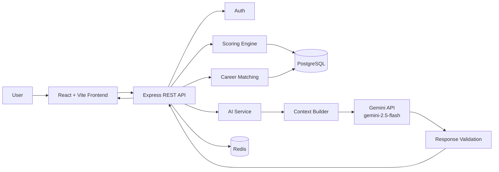
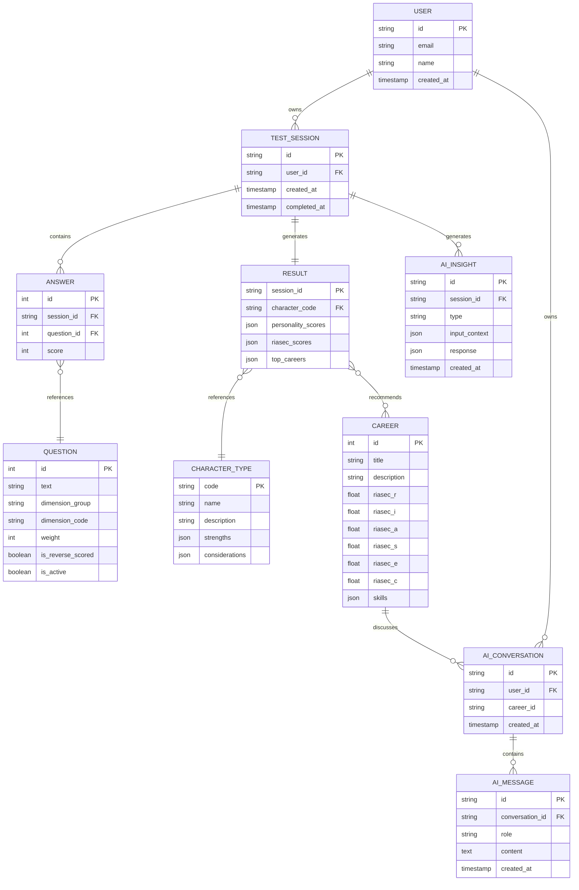

# PRD: AKARA Platform Tes Kepribadian, Career Fit & AI Career Coach

**Status:** Draft v2  
**Owner:** Rozi  
**Target:** Portfolio / MVP  
**Referensi model:** 16personalities-style personality dimensions + RIASEC/Holland Code untuk career-fit  

---

## 1. Ringkasan Produk

Platform ini membantu mahasiswa, fresh graduate, atau siswa dan pengguna yang sedang mengeksplorasi karier untuk memahami kecenderungan kepribadian, minat karier, serta pilihan karier yang sesuai.

Konsep dasar tetap menggunakan dua lapisan:

1. **Personality** - menghasilkan 1 dari 16 kombinasi tipe karakter berbasis empat pasangan dimensi.
2. **RIASEC** - menghasilkan profil minat karier dan ranking karier berdasarkan kemiripan vektor.

Pada versi baru, platform ditambahkan **AI Career Coach**. AI tidak menggantikan scoring engine. Scoring personality dan RIASEC tetap deterministik dan dapat diaudit. AI digunakan untuk mengubah hasil terstruktur menjadi insight yang lebih personal, menjelaskan alasan rekomendasi, membantu eksplorasi karier, dan membuat career action plan.

### Prinsip utama

```text
Psychometric-style scoring
        ↓
Deterministic result
        ↓
Career matching
        ↓
Structured career data
        ↓
AI Career Coach
        ↓
Personalized explanation + action plan
```

Dengan pendekatan ini, AI menjadi fitur inti produk, bukan sekadar chatbot yang ditempel di aplikasi.

---

# 2. Masalah yang Ingin Diselesaikan

Test kepribadian populer menarik untuk self-understanding, tetapi belum tentu memberikan rekomendasi karier yang konkret.

RIASEC lebih relevan untuk eksplorasi minat karier, tetapi hasil berbasis skor dapat terasa kaku bagi pengguna.

Masalah tambahan setelah mendapatkan hasil test:

- User belum tentu memahami arti tipe kepribadiannya.
- User tidak tahu mengapa sebuah karier masuk ranking teratas.
- User tidak tahu skill apa yang perlu dipelajari.
- User kesulitan mengubah hasil test menjadi langkah nyata.
- User mungkin memiliki beberapa karier yang sama-sama cocok dan ingin membandingkannya.

Produk ini menjembatani:

```text
"Siapa saya?"
       ↓
"Minat saya apa?"
       ↓
"Karier apa yang cocok?"
       ↓
"Kenapa karier itu cocok?"
       ↓
"Apa yang harus saya lakukan selanjutnya?"
```

---

# 3. Tujuan Produk

## 3.1 Tujuan Utama

1. User dapat menyelesaikan personality + career interest test.
2. Sistem menghasilkan personality type yang konsisten berdasarkan scoring engine.
3. Sistem menghasilkan profil RIASEC user.
4. Sistem menghitung ranking karier menggunakan cosine similarity.
5. AI menjelaskan hasil menggunakan data hasil test yang terstruktur.
6. AI memberikan career action plan berdasarkan karier yang dipilih user.
7. User dapat melakukan eksplorasi karier melalui AI Career Coach.

## 3.2 Non-Goals

Produk tidak bertujuan:

- mendiagnosis kondisi psikologis;
- menentukan satu pekerjaan yang "pasti cocok";
- menggantikan konselor karier;
- menggunakan LLM untuk menentukan skor personality/RIASEC;
- memberikan keputusan karier secara absolut.

---

# 4. Target Pengguna

### Primary

- Mahasiswa.
- Fresh graduate.
- Career switcher.
- Pelajar atau siswa yang sedang mengeksplorasi jurusan/karier.

### Secondary

- Career center kampus.
- Bootcamp.
- Komunitas mahasiswa.
- HR/recruitment sebagai potential future use case.

---

# 5. Konsep Produk

Produk memiliki 4 layer utama:

```text
1. Assessment
   ↓
2. Career Matching
   ↓
3. AI Explanation
   ↓
4. AI Career Planning
```

## Layer 1 - Assessment

User mengisi statement dengan skala Likert 1–5.

## Layer 2 - Career Matching

Scoring engine menghitung:

- Personality: 4 dimensi.
- RIASEC: 6 dimensi.
- Career match: cosine similarity.

## Layer 3 - AI Explanation

AI menerima hasil terstruktur, bukan menghitung ulang hasil.

Contoh input AI:

```json
{
  "personality": {
    "code": "INTJ",
    "name": "Sang Strategis"
  },
  "riasec": {
    "R": 32,
    "I": 88,
    "A": 51,
    "S": 36,
    "E": 72,
    "C": 64
  },
  "topCareers": [
    {
      "title": "Software Engineer",
      "match": 91
    },
    {
      "title": "Data Analyst",
      "match": 88
    }
  ]
}
```

AI kemudian menghasilkan penjelasan yang grounded pada data tersebut.

## Layer 4 - AI Career Planning

User memilih career target.

AI membantu membuat:

- skill gap;
- learning roadmap;
- project recommendation;
- portfolio recommendation;
- interview preparation;
- langkah 30/60/90 hari.

---

# 6. Fitur AI

## 6.1 AI Result Explanation - MVP

Setelah user mendapatkan hasil, tersedia section:

### "AI Insight"

Contoh:

> Berdasarkan profil RIASEC kamu, skor Investigative dan Enterprising relatif tinggi. Ini menunjukkan kecenderungan pada aktivitas analitis sekaligus aktivitas yang membutuhkan pengambilan keputusan dan inisiatif.

AI harus menggunakan hasil scoring sebagai source of truth.

### Output:

- Personality explanation.
- RIASEC explanation.
- Strengths.
- Potential work preferences.
- Things to consider.

---

## 6.2 Why This Career?

Setiap career result memiliki tombol:

**"Kenapa karier ini cocok?"**

AI menerima:

- RIASEC user;
- RIASEC career;
- personality result;
- career description;
- match percentage.

Output:

```text
Kenapa Software Engineer?

• Investigative kamu tinggi → cocok dengan aktivitas problem-solving.
• Career profile membutuhkan Investigative yang tinggi.
• Personality kamu juga menunjukkan kecenderungan pada pekerjaan
  yang membutuhkan fokus dan analisis.

Yang perlu diperhatikan:
• Pekerjaan ini tetap membutuhkan kolaborasi.
• Hasil test bukan jaminan bahwa pekerjaan ini pasti cocok.
```

---

## 6.3 AI Career Roadmap - MVP+

User memilih:

> "Saya ingin menjadi Data Analyst."

AI membuat roadmap:

```text
Phase 1 - Fundamental
├── Excel
├── SQL
└── Basic Statistics

Phase 2 - Analytics
├── Python
├── Pandas
└── Data Visualization

Phase 3 - Portfolio
├── Sales Dashboard
├── Customer Analysis
└── Business Analytics Project

Phase 4 - Job Preparation
├── CV
├── Portfolio
└── Interview
```

AI harus mengambil skill dasar dari database career profile terlebih dahulu. LLM berfungsi menyusun dan mempersonalisasi roadmap, bukan mengarang requirement secara bebas.

---

## 6.4 AI Career Coach Chat - Fase 2

User dapat bertanya:

> "Kalau saya suka coding tapi tidak terlalu suka matematika, apakah Data Analyst masih relevan?"

AI menjawab berdasarkan:

- profil user;
- career database;
- skill requirements;
- hasil assessment.

Chat tidak boleh mengubah hasil test.

---

## 6.5 Career Comparison - Fase 2

User memilih dua atau tiga karier:

```text
Software Engineer
vs
Data Analyst
vs
Product Designer
```

AI membantu menjelaskan perbedaan:

- aktivitas kerja;
- skill;
- environment;
- kecenderungan RIASEC;
- learning path;
- kemungkinan gap berdasarkan profil user.

AI tidak memilihkan pemenang. User tetap membuat keputusan.

---

## 6.6 AI CV/Job Description Matching - Future

User dapat upload CV dan job description.

AI menganalisis:

```text
Profile
   +
CV
   +
Job Description
   ↓
Skill Match
   ↓
Skill Gap
   ↓
Improvement Suggestions
```

Fitur ini sengaja ditempatkan setelah core assessment stabil karena membutuhkan document parsing dan additional AI cost.

---

# 7. Fitur Non-AI

## MVP

- Landing page.
- Start test.
- Randomized questions.
- Progress tracking.
- Likert 1–5.
- Submit test.
- Personality scoring.
- RIASEC scoring.
- Career matching.
- Result page.
- Top 10 careers.
- Career detail.
- AI Result Explanation.
- AI "Why This Career?".
- Guest result menggunakan session ID.

## Fase 2

- Authentication.
- Test history.
- Retake.
- Compare results.
- Shareable result.
- Admin dashboard.
- CRUD questions.
- CRUD personality types.
- CRUD careers.
- Career comparison.
- AI Career Coach.

## Fase 3

- CV upload.
- Job description matching.
- Personalized portfolio roadmap.
- Analytics dashboard.
- Recommendation improvement berdasarkan aggregated anonymous data.

---

# 8. Personality Model

Mengikuti model 4 dimensi yang disederhanakan:

| Aspek | Kutub A | Kutub B |
|---|---|---|
| Energy | Introvert (I) | Extrovert (E) |
| Mind | Observant (S) | Intuitive (N) |
| Nature | Thinking (T) | Feeling (F) |
| Tactics | Judging (J) | Prospecting (P) |

4 dimensi menghasilkan:

```text
2⁴ = 16 kombinasi
```

Setiap kombinasi mempunyai:

- code;
- custom name;
- short description;
- strengths;
- work preferences;
- considerations.

---

# 9. RIASEC Model

| Code | Name | General Interest |
|---|---|---|
| R | Realistic | Technical / hands-on |
| I | Investigative | Analysis / research |
| A | Artistic | Creativity / design |
| S | Social | Helping / teaching |
| E | Enterprising | Leadership / business |
| C | Conventional | Structure / data |

Setiap career mempunyai vector:

```text
R I A S E C
2 5 2 1 2 3
```

User juga menghasilkan vector RIASEC.

Career matching menggunakan cosine similarity.

---

# 10. Scoring Engine

AI **tidak** melakukan scoring.

Scoring engine:

1. Ambil semua answer.
2. Join dengan question.
3. Apply reverse scoring jika diperlukan.
4. Agregasi setiap dimension.
5. Normalisasi ke 0–100.
6. Tentukan dominant pole untuk personality.
7. Generate 4-letter personality code.
8. Generate RIASEC vector.
9. Hitung cosine similarity terhadap setiap career.
10. Sort career berdasarkan similarity.
11. Simpan result.
12. Kirim structured result ke AI layer jika user meminta AI insight.

### Formula

Untuk career matching:

```text
cosine_similarity(A, B)
=
(A · B) / (||A|| × ||B||)
```

Match percentage harus ditentukan oleh backend secara konsisten. LLM tidak boleh menentukan persentase.

---

# 11. AI Architecture

## Prinsip

Gunakan pendekatan:

**Deterministic Engine + LLM**

```text
User
 ↓
Assessment
 ↓
Scoring Engine
 ↓
Structured Result
 ↓
Career Database
 ↓
AI Context Builder
 ↓
LLM
 ↓
Validated AI Response
 ↓
Frontend
```

## AI Context Builder

Backend membuat context terstruktur:

```json
{
  "personality": {},
  "riasec": {},
  "career": {},
  "skills": [],
  "user_question": ""
}
```

Jangan mengirim seluruh database ke LLM.

---

# 12. RAG / Knowledge Base

Untuk MVP, belum perlu membuat RAG kompleks.

Gunakan:

```text
PostgreSQL
+
Career structured data
+
LLM
```

Pada Fase 2, jika career knowledge semakin besar:

```text
Career documents
       ↓
Chunking
       ↓
Embedding
       ↓
pgvector
       ↓
Semantic Search
       ↓
Relevant Career Context
       ↓
LLM
```

Karena PostgreSQL + pgvector dapat berada dalam ekosistem yang sama, arsitektur tidak perlu menambah vector database terpisah pada tahap awal.

---

# 13. Rekomendasi Tech Stack

## Frontend

- React (Vite SPA)
- React Router (v6/v7 untuk client-side routing)
- TypeScript
- Tailwind CSS
- shadcn/ui (Vite version)
- TanStack Query
- Axios (HTTP Client terpusat dengan interceptor & timeout)
- Vitest + React Testing Library + jsdom (Unit & Component Testing)
- ESLint & Prettier (Code Linter & Formatter dengan `prettier-plugin-tailwindcss`)
- React Hook Form
- Zod
- Recharts
- Lucide React (Icons)

## Backend

- Node.js
- Express.js
- TypeScript
- Prisma ORM
- PostgreSQL (Neon serverless)
- Vitest + Supertest (Unit Testing Service & API Integration Testing)
- ESLint & Prettier (TypeScript Linter & Code Formatter)
- Swagger UI (`swagger-ui-express` & `swagger-jsdoc` / OpenAPI 3.0) untuk dokumentasi dan uji coba API interaktif

## Cache

- Redis (via Upstash - serverless, free tier permanen, tanpa kartu kredit)
- Gunakan untuk:
  - question bank;
  - career profiles;
  - rate limiting;
  - temporary AI response cache jika diperlukan.

## AI

- **Google Gemini API** (model `gemini-2.5-flash`) melalui backend - dipilih karena free tier permanen (bukan trial kredit yang expired), support Structured Output/JSON schema native, dan kuota gratis (±500 request/hari) lebih dari cukup untuk portofolio/demo.
- Structured Outputs / JSON schema untuk response AI yang membutuhkan format konsisten.
- Gunakan model yang sesuai kebutuhan biaya/latency; jangan mengunci produk pada satu model di level frontend - abstraksi AI service supaya provider bisa diganti (misal ke Groq untuk task yang butuh latency rendah) tanpa mengubah business logic.
- Alternatif/backup: **Groq API** (model open-source seperti Llama 3.3 70B) - free tier permanen, inference sangat cepat, cocok untuk fase AI Chat yang butuh respons real-time.

## Authentication

Fase 2:

- JWT access token.
- Refresh token.
- HTTP-only cookie untuk session/refresh token jika sesuai arsitektur.

## Storage

Fase 2:

- Supabase Storage (free tier) untuk CV dan dokumen - S3-compatible, tanpa kartu kredit untuk tier gratis.

## Deployment - 100% Free Tier (tanpa kartu kredit, tanpa trial kredit yang expired)

Frontend:

- **Vercel / Cloudflare Pages / Netlify** - free tier permanen untuk Static SPA (Vite build output), auto-deploy dari GitHub, 0 cold start, performa CDN global.

Backend:

- **Vercel** (Serverless Express / Serverless Function via `@vercel/node` / `api/index.ts`) - gratis permanen, auto-deploy dari GitHub; menghindari masalah *sleep setelah 15 menit idle* seperti di Render, sehingga demo portofolio selalu siap diakses tanpa delay cold start 30–60 detik.
  > *Catatan Serverless*: Karena berjalan secara stateless/serverless, gunakan Neon connection pooler URL (`?sslmode=require&pgbouncer=true`) pada konfigurasi Prisma `DATABASE_URL` untuk mencegah connection exhaustion.

Database:

- **Neon** (serverless PostgreSQL) - free tier permanen, lebih stabil & generous dibanding opsi Postgres gratis lain, tanpa kartu kredit.

Redis:

- **Upstash** (serverless Redis) - free tier permanen, model pay-per-request dengan kuota gratis yang luas.

> Catatan: Railway sudah tidak menyediakan free tier permanen (butuh top-up minimal), sehingga tidak direkomendasikan untuk target "100% gratis dari development sampai deploy".

---

# 14. Kenapa Stack Ini Dipilih?

### React + Vite + TypeScript

Arsitektur yang jauh lebih ramping, modular, dan terhindar dari *overkill*. Karena backend sudah menggunakan **Express.js** untuk scoring engine, database transaction, dan proxy AI Gemini yang aman, penggunaan Next.js akan redundan (menjalankan dua server Node.js, overhead SSR/App Router, dan kompleksitas Server/Client Components).

Keunggulan React + Vite:
- **Developer Experience (DX) Cepat**: Instant server start dan Lightning-fast Hot Module Replacement (HMR).
- **Pure Client SPA**: Output build berupa aset statis murni (HTML/JS/CSS) yang di-host di CDN global tanpa runtime server frontend dan bebas cold start.
- **Pemisahan Concern yang Bersih**: Frontend murni mengelola interaktivitas (test wizard, progress state, radar chart, action plan UI), sementara Express menangani scoring logic deterministik dan AI guardrails.
- **shadcn/ui on Vite**: Tetap mendapatkan komponen modern, accessible, dan modular berbasis Tailwind CSS dengan kebebasan kustomisasi penuh.

### Express

Memisahkan business logic dari frontend dan membuat scoring engine lebih mudah diuji.

### Prisma

Mempermudah pengelolaan schema dan query PostgreSQL menggunakan TypeScript.

### PostgreSQL

Cocok untuk data relational:

```text
users
questions
answers
careers
results
sessions
ai_conversations
```

### Redis (Upstash)

Bukan wajib untuk MVP, tetapi berguna ketika question bank dan career data mulai sering dibaca. Dipilih Upstash karena serverless dan free tier-nya permanen (tidak seperti Redis terkelola berbayar pada umumnya).

### Google Gemini API

Digunakan hanya dari backend agar API key tidak terekspos ke browser. Dipilih dibanding OpenAI API karena Gemini punya **free tier permanen** (bukan kredit trial yang expired dalam 30 hari), sehingga selaras dengan target "gratis dari development sampai deploy". Model `gemini-2.5-flash` mendukung structured/JSON output secara native, cocok untuk kebutuhan AI response yang harus tervalidasi schema (lihat Section 18). Groq (model open-source) disiapkan sebagai alternatif untuk task yang butuh latency sangat rendah, misalnya AI Chat di fase 2.

### pgvector

Belum wajib pada MVP. Bisa ditambahkan saat career knowledge base membutuhkan semantic retrieval.

---

# 15. Arsitektur Sistem



---

# 16. Database Schema



---

# 17. API Design

## Documentation

```text
GET    /api-docs             (Interactive Swagger UI)
GET    /api-docs.json        (OpenAPI 3.0 Specification JSON)
```

## Assessment

```text
GET    /api/test/questions
POST   /api/test/session
POST   /api/test/session/:id/answers
POST   /api/test/session/:id/submit
GET    /api/test/session/:id/result
```

## Career

```text
GET    /api/careers
GET    /api/careers/:id
GET    /api/careers/:id/similar
```

## AI

```text
POST   /api/ai/result-insight
POST   /api/ai/career-explanation
POST   /api/ai/career-roadmap
POST   /api/ai/chat
```

## Auth - Fase 2

```text
POST   /api/auth/register
POST   /api/auth/login
POST   /api/auth/refresh
POST   /api/auth/logout
GET    /api/auth/me
```

---

# 18. AI API Rules

Backend wajib melakukan:

1. Validate user/session.
2. Retrieve deterministic result.
3. Retrieve relevant career data.
4. Build structured AI context.
5. Send request to LLM.
6. Validate response schema.
7. Store useful response if needed.
8. Return response to frontend.

### AI response example

```json
{
  "summary": "Kamu memiliki kecenderungan kuat pada aktivitas analitis...",
  "strengths": [
    "Problem solving",
    "Analytical thinking"
  ],
  "considerations": [
    "Perlu memperhatikan kemampuan komunikasi..."
  ],
  "next_steps": [
    "Pelajari SQL",
    "Buat satu project data analysis"
  ]
}
```

Structured response lebih aman daripada meminta AI mengembalikan teks bebas untuk semua bagian.

---

# 19. AI Guardrails

AI harus:

- tidak mengubah personality score;
- tidak mengubah RIASEC score;
- tidak mengubah match percentage;
- tidak menyatakan satu karier sebagai kepastian;
- menyebutkan keterbatasan hasil ketika relevan;
- tidak membuat klaim psikologis/medis;
- menggunakan career database sebagai sumber informasi utama;
- menghindari informasi yang tidak didukung context;
- memberikan jawaban yang actionable tetapi tetap memberi ruang bagi keputusan user.

Jika informasi tidak tersedia:

```text
"Saya belum memiliki informasi yang cukup untuk menjawab bagian tersebut."
```

bukan mengarang data.

---

# 20. Frontend Pages

```text
/
├── Landing
│
├── /test
│   ├── intro
│   ├── questions
│   └── completion
│
├── /result/[sessionId]
│   ├── personality
│   ├── riasec
│   ├── career-ranking
│   ├── ai-insight
│   └── career-explanation
│
├── /careers
│
├── /careers/[id]
│
├── /coach
│
└── /dashboard                 # Fase 2
    ├── history
    ├── profile
    └── saved-careers
```

---

## 20.1 Design System & Visual Identity (Duolingo-Inspired Style)

Desain antarmuka AKARA mengadopsi prinsip **Gamified & Playful Storybook** yang terinspirasi dari Duolingo (dokumentasi lengkap di `DESIGN.md`), untuk membuat proses penemuan karier terasa menyenangkan, bersahabat, dan tidak menegangkan bagi pelajar maupun *fresh graduate*.

### Karakteristik Visual Utama:
1. **Paper White Canvas**: Latar belakang putih bersih (`#ffffff`), bukan dark mode atau gradien buram, memberikan kesan bersih seperti kanvas buku cerita.
2. **Sticker-like Components**: Tombol dan kartu berpenampilan seperti stiker taktil dengan radius membulat tebal (`12px` / `rounded-xl`) dan border tegas `2px solid` (`#afafaf` atau warna aksen).
3. **Palet Warna Emosional**:
   - **Eager Green (`#58cc02`)**: Warna progres, tombol CTA utama "Mulai Tes", status sukses, dan persentase *match*.
   - **Spark Blue (`#1cb0f6`)**: Aksen interaktif, link, tombol sekunder, dan badge kategori RIASEC.
   - **Storybook Green (`#d7ffb8`)**: Warna tint lembut untuk latar belakang badge dan highlight card.
   - **Charcoal (`#4b4b4b`) & Pencil Gray (`#777777`)**: Teks utama dan deskripsi agar tipografi terbaca nyaman tanpa mendominasi warna hijau.
4. **Tipografi Bersahabat**: Menggunakan display font membulat (seperti *Nunito Black* / *Feather*) untuk heading, dan sans-serif geometris (*Inter* / *Nunito Sans*) untuk body copy.
5. **No Clutter & Flat Aesthetics**: Menghindari bayangan berlebihan (*drop shadow* pekat) atau efek kaca (*glassmorphism*). Elemen UI dibuat datar, tegas, dan berbobot.

---

# 21. Result Page

Struktur:

```text
Your Result
│
├── Personality
│   ├── Character Name
│   ├── 4-letter Code
│   ├── Description
│   └── Radar Chart
│
├── RIASEC
│   ├── 6 Dimension Scores
│   └── Radar Chart
│
├── AI Insight
│   ├── Summary
│   ├── Strengths
│   └── Considerations
│
├── Recommended Careers
│   ├── #1 Career
│   ├── #2 Career
│   └── ...
│
└── AI Career Explanation
    └── Why this career?
```

---

# 22. Admin Panel

Fase 2.

Admin dapat:

### Questions

- create;
- edit;
- delete/deactivate;
- set dimension;
- set weight;
- set reverse scoring.

### Careers

- create;
- edit;
- delete;
- set RIASEC vector;
- set required skills;
- set description.

### Character

- manage 16 personality types;
- name;
- description;
- strengths;
- considerations.

### Analytics

- total test;
- completion rate;
- popular career;
- distribution personality;
- distribution RIASEC.

---

# 23. Sprint Timeline

Target MVP: **4 minggu** dengan 1 developer.

## Sprint 0 - Product & Data Preparation
**Durasi: 2–3 hari**

### Output

- Finalisasi user flow.
- Finalisasi scoring rules.
- Finalisasi schema.
- Draft 60–80 questions.
- Draft 30–50 careers.
- Draft 16 character types.
- Tentukan AI output schema.
- Setup repository.

### Definition of Done

```text
[ ] Scoring rules documented
[ ] DB schema approved
[ ] Question format ready
[ ] Career format ready
[ ] AI prompt/output contract ready
```

---

## Sprint 1 - Backend Foundation
**Hari 1–5**

### Task

- Setup Express + TypeScript.
- Setup Prisma.
- Setup PostgreSQL.
- Setup Swagger UI & OpenAPI documentation (`/api-docs`).
- Migration.
- Seed questions.
- Seed careers.
- Seed character types.
- Implement test session.
- Implement answer submission.
- Implement validation dengan Zod.
- Implement basic API error handling.

### Output

Backend sudah bisa:

```text
Start Test
→ Get Questions
→ Submit Answers
```

---

## Sprint 2 - Scoring Engine + Career Matching
**Hari 6–10**

### Task

- Reverse scoring.
- Personality scoring.
- RIASEC scoring.
- Normalization.
- Personality code generation.
- Cosine similarity.
- Top 10 career.
- Save result.
- Unit test scoring engine.

### Output

```text
Answers
 ↓
Scoring Engine
 ↓
Personality
+
RIASEC
+
Career Ranking
```

**Prioritas testing:** scoring engine harus dapat diuji tanpa frontend dan tanpa AI.

---

## Sprint 3 - Frontend Assessment + Result
**Hari 11–15**

### Task

- Setup React + Vite + TypeScript + Tailwind CSS + shadcn/ui.
- Landing page.
- Test intro.
- Question UI.
- Progress bar.
- Answer state.
- Submit flow.
- Result page.
- Personality card.
- Radar chart.
- Career ranking.
- Career detail.

### Output

User sudah bisa menyelesaikan seluruh test sampai melihat hasil tanpa AI.

---

## Sprint 4 - AI Integration
**Hari 16–20**

### Task

### Day 16

- Setup AI service.
- Backend-only API key.
- AI context builder.

### Day 17

- AI Result Insight.
- Structured output.
- Response validation.

### Day 18

- AI Why This Career.
- Career context injection.
- Guardrails.

### Day 19

- AI Career Roadmap.
- Skill data.
- Roadmap schema.

### Day 20

- Loading/error state.
- Rate limiting.
- Logging.
- Token/cost monitoring.
- Prompt refinement.

### Output

```text
Assessment
 ↓
Deterministic Result
 ↓
AI Insight
 ↓
Career Explanation
 ↓
Career Roadmap
```

---

## Sprint 5 - Auth, History & Polish
**Hari 21–25**

### Task

- JWT authentication.
- User profile.
- Test history.
- Retake.
- Saved career.
- Result share link.
- Responsive UI.
- Empty/loading/error states.
- Security review.

---

## Sprint 6 - Deployment & Portfolio
**Hari 26–28**

### Task

- Production database (Neon).
- Deploy frontend (Vercel).
- Deploy backend (Vercel Serverless Function).
- Environment variables (termasuk Gemini API key - hanya di backend).
- Redis (Upstash).
- CORS.
- Rate limiting (khususnya endpoint AI, untuk jaga kuota free tier Gemini/Groq).
- Error monitoring (Sentry free tier).
- README.
- Architecture diagram.
- Demo account.
- Project documentation.

### Final Output

```text
Live Demo
+
GitHub
+
README
+
Architecture Diagram
+
ERD
+
API Documentation
+
AI Architecture
+
Demo Data
```

---

# 24. Daftar Fitur Lengkap & Matriks Pembagian Tugas Tim (Jobdesk)

Berikut rincian lengkap seluruh fitur platform **AKARA — AI Career Platform** yang dibagi menjadi dua fase pengerjaan, lengkap dengan alokasi penanggung jawab (*Feature Ownership*) antara **Rozi (Backend & Core Flows)** dan **Diki (Frontend & Career UI Components)**.

---

## 24.1 Fase 1: MVP Core (Sprint 1 — Target Utama Peluncuran)

Fase ini berfokus pada **Satu Alur Sukses Tunggal (*The One Happy Path*)**: User masuk ke web tanpa login -> mengisi 20 soal kuis -> sistem menghitung skor -> muncul dashboard hasil lengkap dengan grafik radar RIASEC, narasi AI, dan daftar rekomendasi karier.

| No | Modul / Fitur | Deskripsi Fungsionalitas | Frontend / Backend | Penanggung Jawab (Jobdesk) |
| :---: | :--- | :--- | :--- | :--- |
| **1** | **Setup Arsitektur Monorepo & DB** | Inisialisasi monorepo (`client/` & `server/`), koneksi Neon PostgreSQL, Prisma ORM, konfigurasi Vitest, ESLint, Prettier, dan Swagger UI. | Fullstack (Setup) | **Rozi** |
| **2** | **Seed Data Karier & Soal Kuis** | Menyusun file `seed.ts` berisi 20 soal kepribadian/minat dan 25–30 profil profesi Indonesia (deskripsi, rentang gaji, tag skill, dan nilai acuan 6 vektor RIASEC). | Data & Seed | **Diki** |
| **3** | **Scoring Engine Deterministik** | Menghitung 4 dimensi MBTI, normalisasi skor mentah RIASEC ke skala 0–100, dan generator kode kepribadian 16 karakter tanpa campur tangan AI (100% auditabel). | Backend (Service) | **Rozi** |
| **4** | **Matching Engine Cosine Similarity** | Algoritma perbandingan kedekatan sudut vektor 6 dimensi RIASEC user vs database karier untuk menghasilkan persentase kecocokan (*Match Score %*). | Backend (Service) | **Rozi** |
| **5** | **Halaman Beranda (Landing Page)** | Halaman utama bergaya Duolingo: Hero section, tipografi charcoal, ilustrasi maskot ramah, bar keunggulan platform, tombol CTA hijau besar ("Mulai Tes Gratis"), dan footer. | Frontend (UI) | **Rozi** |
| **6** | **Wizard Kuis Asesmen (`/test`)** | Halaman pengerjaan kuis interaktif satu soal per layar, progress bar animasi hijau chunky, 5 tombol pilihan skala Likert bergaya stiker taktil, dan auto-save jawaban lokal. | Frontend & Backend API | **Rozi** |
| **7** | **Visualisasi RIASEC Radar Chart** | Grafik poligon interaktif 6 dimensi (Holland Codes) menggunakan **Recharts**, berlatar kanvas putih dengan stroke hijau/biru cerah, responsif, dan tooltip detail saat kursor di-hover. | Frontend (UI Component) | **Diki** |
| **8** | **Katalog Kartu Rekomendasi Karier** | Menampilkan daftar top profesi paling cocok: Kartu bergaya stiker putih ber-border 2px, badge persentase *Match Score %*, pill estimasi rentang gaji, dan skill chips. | Frontend (UI Component) | **Diki** |
| **9** | **Modal Detail Karier (`CareerModal`)** | Dialog popup responsif saat kartu karier diklik: Menampilkan deskripsi lengkap profesi, prospek industri kerja di Indonesia, dan daftar skill wajib. | Frontend (UI Component) | **Diki** |
| **10** | **AI Result Insight Narrative** | Integrasi Google Gemini 2.5 Flash via Zod Structured Outputs: Menghasilkan analisis ringkasan kepribadian, kekuatan utama, dan area pengembangan tanpa mengubah angka skor. | Backend (AI) & Frontend UI | **Rozi** |
| **11** | **AI Career Roadmap 4 Fase** | Prompt pipeline Gemini yang menyusun rencana aksi konkret 4 fase (Fundamental, Tools, Portofolio, Interview) dan komponen visual checklist 30/60/90 hari. | Fullstack (AI & UI) | **Rozi** |
| **12** | **Panduan Tipe RIASEC & FAQ** | Komponen edukasi visual 6 kartu dimensi Holland (Realistic s/d Conventional) dan accordion FAQ seputar interpretasi hasil tes. | Frontend (UI Component) | **Diki** |
| **13** | **Automated Testing Suite (Vitest)** | Unit test untuk scoring engine & math similarity di backend, serta unit test interaksi komponen kuis di frontend. Wajib lulus 100% sebelum PR. | Testing | **Rozi & Diki** |

---

## 24.2 Fase 2: Enhanced & Scaling (Pasca-MVP)

Fitur-fitur penyempurnaan yang dikerjakan setelah alur utama MVP berhasil diuji coba dan stabil di production.

| No | Modul / Fitur | Deskripsi Fungsionalitas | Penanggung Jawab |
| :---: | :--- | :--- | :--- |
| **14** | **User Authentication & Session Management** | Registrasi akun, Login, JWT access token, refresh token, dan enkripsi password (bcrypt). | **Rozi** |
| **15** | **User Profile & Riwayat Hasil Tes** | Halaman dashboard user untuk melihat riwayat tes masa lalu dan menyimpan karier favorit (*Bookmark*). | **Diki** |
| **16** | **Fitur Perbandingan Karier (Comparison)** | Tabel perbandingan berdampingan untuk 2–3 karier (membandingkan gaji, skill, dan dimensi kecocokan). | **Rozi** |
| **17** | **Admin Panel CRUD Soal & Karier** | Dashboard internal admin untuk menambah, mengedit, atau menonaktifkan data pertanyaan dan profil karier. | **Diki** |
| **18** | **Upstash Redis Caching & Rate Limiting** | Caching daftar pertanyaan kuis di memori RAM dan proteksi spam request pada endpoint AI. | **Rozi** |
| **19** | **AI Interactive Career Coach (Chat)** | Chatbot percakapan interaktif konsultasi karier berbasis Gemini API dengan batas kuota dan guardrail ketat. | **Rozi** |
| **20** | **Export Hasil & Roadmap ke PDF** | Tombol cetak/unduh ringkasan hasil tes asesmen dan action plan roadmap karier dalam bentuk file PDF rapi. | **Diki** |

---

# 25. Testing Strategy (Vitest Unified Stack)

AKARA menggunakan **Vitest** sebagai test runner terpadu untuk Frontend dan Backend untuk memastikan kecepatan eksekusi, native TypeScript/ESM support, dan konsistensi sintaks bagi seluruh developer.

> [!IMPORTANT]
> **Quality Gate Wajib (Zero Failing Tests)**:  
> Setiap branch fitur **wajib lulus 100% test (`npm run test:run`)** sebelum diperbolehkan membuka Pull Request (PR) atau dimerge ke `develop`.

```text
┌─────────────────────────────────────────────────────────────┐
│                      AKARA TEST STACK                       │
├──────────────────────────────┬──────────────────────────────┤
│       BACKEND TESTING        │       FRONTEND TESTING       │
├──────────────────────────────┼──────────────────────────────┤
│ • Runner: Vitest             │ • Runner: Vitest             │
│ • HTTP / API: Supertest      │ • DOM Env: jsdom             │
│ • DB Mock: vitest-mock-ext   │ • Library: Testing Library   │
│ • Unit: Services, Math, Zod  │ • Unit: Hooks, Components    │
└──────────────────────────────┴──────────────────────────────┘
```

## 25.1 Unit Test

### Backend (Vitest)
Fokus pada determinisme algoritma, validasi schema, dan isolasi fungsi bisnis:
- `scoringEngine()`: Kalkulasi 4 dimensi MBTI dan 6 dimensi RIASEC mentah.
- `reverseScore()`: Pembalikan skor untuk pernyataan bertanda minus/negatif.
- `normalizeScore()`: Konversi skor mentah ke rentang standar 0–100.
- `generatePersonalityCode()`: Penentuan kode tipe kepribadian 16 karakter.
- `calculateCosineSimilarity()`: Perhitungan akurasi kemiripan sudut vektor profil user vs acuan karier.
- `rankCareers()`: Pengurutan dan filtering rekomendasi karier.
- Zod Request Validation: Memastikan payload kuis dan query terfilter dengan ketat.

### Frontend (Vitest + React Testing Library)
Fokus pada interaktivitas komponen, custom hooks, dan validasi tampilan:
- `ScaleSelector`: Memastikan event `onChange` terpicu dengan nilai skala 1–5.
- `useAssessmentSession`: State management jawaban kuis tersimpan dan sinkron.
- `ProgressBar`: Perhitungan persentase progres soal sesuai jumlah terjawab.
- `RiasecRadarChart`: Render canvas polygon tanpa error runtime saat menerima data 6 dimensi.
- `CareerCard`: Menampilkan badge match score % dan event klik modal detail.

## 25.2 Integration Test (Backend: Vitest + Supertest)

Menguji alur endpoint Express dari controller hingga middleware tanpa mocking internal express:
- `GET /api/test/questions`: Mengembalikan 200 OK dengan format response baku `{ success: true, data: [...] }`.
- `POST /api/test/session`: Inisialisasi sesi asesmen baru.
- `POST /api/test/session/:id/answers`: Validasi input jawaban parsial/batch.
- `POST /api/test/session/:id/submit`: Alur submit lengkap -> kalkulasi scoring -> simpan result ke database.
- `GET /api/test/session/:id/result`: Menampilkan profil hasil tes dan daftar rekomendasi karier.
- Error Case: Memastikan status code 400 saat payload cacat dan 404 saat session ID fiktif.

## 25.3 AI Test & Guardrails

Buat test cases otomatis untuk skenario edge-case AI:
- **Valid result**: Response AI sesuai Zod Structured Output schema tanpa properti hilang.
- **Missing career data**: Fallback pesan ramah ketika data karier tidak lengkap.
- **Invalid AI response**: Fallback default content saat model mengembalikan JSON parsing error.
- **Prompt injection guard**: AI tidak boleh mengeksekusi instruksi liar dari input user.
- **Score protection**: AI dilarang keras mengubah angka skor deterministik dari database.
- **Timeout / Rate limit**: Penanganan graceful saat API Gemini mengalami delay atau HTTP 429.

---

# 26. Security

- API key AI hanya di backend.
- Jangan expose secret ke frontend.
- Validate semua input.
- Rate limit endpoint AI.
- Limit request size.
- Sanitize/validate user input.
- HTTP-only cookie untuk refresh token jika menggunakan cookie auth.
- Jangan menyimpan API key di database.
- Jangan mengirim data user yang tidak diperlukan ke AI.
- Jangan mengirim seluruh database ke LLM.

---

# 27. Cost Control

AI dapat menjadi bagian paling mahal jika setiap page melakukan request.

Strategi:

1. AI hanya dipanggil ketika user membuka fitur AI.
2. Jangan regenerate response setiap refresh.
3. Cache AI insight jika input context sama.
4. Gunakan structured output.
5. Batasi panjang chat history.
6. Gunakan model yang lebih kecil untuk task sederhana jika kualitas memadai.
7. Gunakan model yang lebih kuat hanya untuk task yang membutuhkan reasoning lebih tinggi.
8. Tambahkan rate limit per user/session.

---

# 28. Branding Recommendation

Jika menggunakan **Kariva**:

```text
Kariva
Know Yourself. Find Your Direction.
```

Product positioning:

> AI-powered career exploration platform yang menggabungkan personality assessment, RIASEC career matching, dan AI Career Coach untuk membantu pengguna memahami dirinya dan mengeksplorasi pilihan karier.

---

# 29. Contoh End-to-End User Journey

```text
Landing
   ↓
"Find Your Career Direction"
   ↓
Start Test
   ↓
60–80 Questions
   ↓
Submit
   ↓
Scoring Engine
   ↓
Personality: INTJ
RIASEC: I-E-C
   ↓
Top Careers
1. Software Engineer
2. Data Analyst
3. Product Analyst
   ↓
AI Insight
   ↓
User klik:
"Why Software Engineer?"
   ↓
AI Explanation
   ↓
User klik:
"Create My Roadmap"
   ↓
AI Career Roadmap
   ↓
30/60/90 Day Plan
```

---

# 30. Success Metrics

Untuk portfolio/MVP:

### Product

- Test completion rate.
- Average test completion time.
- Result page view.
- AI feature usage.
- Career detail click.
- Roadmap generation rate.

### Technical

- API response time.
- Scoring accuracy based on test cases.
- AI response validation success rate.
- AI error rate.
- AI cost per completed assessment.

---

# 31. Risiko

### 1. Hasil dianggap terlalu menentukan

Solusi:

- Disclaimer.
- Gunakan wording "match", "tendency", "exploration".
- Jangan mengatakan "kamu pasti cocok menjadi X".

### 2. AI hallucination

Solusi:

- Structured context.
- Career database.
- Schema validation.
- Guardrails.
- RAG pada fase lanjutan.

### 3. Assessment kurang valid

Solusi:

- Gunakan sumber/model yang jelas.
- Dokumentasikan scoring.
- Jangan klaim sebagai psychological assessment resmi.
- Jika digunakan untuk penelitian serius, lakukan validasi psikometri terpisah.

### 4. AI cost membengkak

Solusi:

- Rate limit.
- Cache.
- On-demand generation.
- Model selection berdasarkan task.

---

# 33. Definition of Done - MVP

MVP dianggap selesai jika:

```text
[ ] User dapat memulai test
[ ] User dapat menyelesaikan test
[ ] Jawaban tersimpan
[ ] Personality score berhasil dihitung
[ ] RIASEC score berhasil dihitung
[ ] Career ranking berhasil dihitung
[ ] Result tersimpan
[ ] User dapat melihat hasil
[ ] AI dapat menjelaskan hasil
[ ] AI dapat menjelaskan alasan career match
[ ] AI tidak mengubah scoring
[ ] AI response tervalidasi
[ ] API key aman
[ ] Rate limit aktif
[ ] Production deployment aktif
[ ] README lengkap
```

---

# 34. Final Recommended Architecture

```text
                    ┌───────────────────┐
                    │   React + Vite    │
                    │  TypeScript + UI  │
                    └─────────┬─────────┘
                              │
                              ▼
                    ┌───────────────────┐
                    │   Express API     │
                    │   TypeScript      │
                    └─────────┬─────────┘
                              │
              ┌───────────────┼────────────────┐
              ▼               ▼                ▼
       ┌─────────────┐ ┌─────────────┐ ┌─────────────┐
       │   Scoring   │ │   Career    │ │ AI Service  │
       │   Engine    │ │   Matching  │ │             │
       └──────┬──────┘ └──────┬──────┘ └──────┬──────┘
              │               │               │
              └───────────────┼───────────────┘
                              ▼
                    ┌───────────────────┐
                    │ PostgreSQL (Neon) │
                    │ Prisma ORM        │
                    └───────────────────┘

                              │
                              ▼
                    ┌───────────────────┐
                    │ Redis (Upstash)   │
                    │ Cache / RateLimit │
                    └───────────────────┘

AI Service
    │
    ▼
┌────────────────────────────┐
│ Gemini API (gemini-2.5-flash) │
│ Structured Output           │
│ (backup: Groq - latency rendah) │
└────────────────────────────┘

Deployment (100% free tier):
Frontend  → Vercel / Cloudflare Pages (Static SPA)
Backend   → Vercel (Serverless Function)
Database  → Neon
Redis     → Upstash

Future:
PostgreSQL + pgvector
        ↓
Career Knowledge Retrieval
        ↓
AI Career Coach
```

---

# 35. Recommended Build Order

Jangan mulai dari AI.

Urutan implementasi:

```text
1. Database
        ↓
2. Assessment
        ↓
3. Scoring Engine
        ↓
4. Career Matching
        ↓
5. Result UI
        ↓
6. AI Result Insight
        ↓
7. AI Career Explanation
        ↓
8. AI Roadmap
        ↓
9. Auth + History
        ↓
10. Admin
        ↓
11. Deploy
        ↓
12. RAG / CV Matching
```

Alasan utama: **AI harus berada di atas data dan logic yang sudah benar.** Kalau scoring dan career database belum stabil, AI hanya akan membuat output terlihat pintar tetapi fondasinya tidak kuat.
