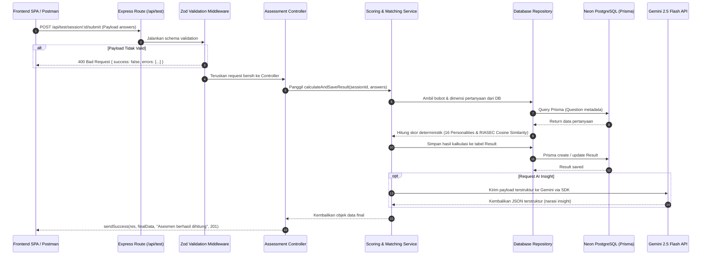

# Backend Architecture, Conventions & API Standards
**Project:** AKARA — AI Career Platform  
**Target Directory:** `server/` (dalam root workspace `AKARA/`)  
**Stack:** Node.js + Express + TypeScript + Prisma ORM + PostgreSQL (Neon) + Gemini 2.5 Flash

---

## 1. Struktur Folder (Layered Architecture)

Backend menggunakan arsitektur berlapis (*Layered / N-Tier Architecture*) yang memisahkan Controller (HTTP), Service (Business Logic), dan Repository (Database Access).

```text
server/
├── api/                        # Entry point untuk Vercel Serverless Function
│   └── index.ts                # Handler yang mengekspor app Express ke Vercel
├── prisma/                     # Konfigurasi database & ORM
│   ├── schema.prisma           # Skema model database PostgreSQL
│   ├── migrations/             # Riwayat migrasi database
│   └── seed.ts                 # Script seeding data (pertanyaan, karier, tipe karakter)
├── src/
│   ├── config/                 # Konfigurasi sistem & koneksi pihak ketiga
│   │   ├── env.ts              # Validasi environment variables (Zod)
│   │   ├── prisma.ts           # PrismaClient instance (dengan pooling Neon)
│   │   ├── redis.ts            # Upstash Redis client
│   │   └── gemini.ts           # Inisialisasi Google GenAI SDK
│   ├── controllers/            # HTTP Handlers (hanya parsing input & kirim response)
│   │   ├── assessment.controller.ts
│   │   ├── career.controller.ts
│   │   └── ai.controller.ts
│   ├── services/               # Core Business Logic murni (tidak menyentuh req/res)
│   │   ├── scoring.service.ts  # Scoring engine deterministik & reverse scoring
│   │   ├── matching.service.ts # Algoritma Cosine similarity untuk RIASEC
│   │   ├── ai.service.ts       # Integrasi Gemini 2.5 Flash & structured output
│   │   └── career.service.ts   # Logika agregasi karier & filtering
│   ├── repositories/           # Database Access Layer (khusus Prisma queries)
│   │   ├── question.repository.ts
│   │   ├── session.repository.ts
│   │   └── career.repository.ts
│   ├── routes/                 # Definisi rute Express & OpenAPI/Swagger annotations
│   │   ├── index.ts            # Agregator seluruh router (/api)
│   │   ├── assessment.routes.ts
│   │   ├── career.routes.ts
│   │   └── ai.routes.ts
│   ├── middlewares/            # Middleware Express
│   │   ├── error.middleware.ts # Global error handling terpusat
│   │   ├── validate.middleware.ts # Validasi schema request Zod
│   │   ├── rate-limit.middleware.ts # Proteksi kuota Gemini & spam
│   │   └── not-found.middleware.ts  # 404 Handler
│   ├── validations/            # Zod validation schemas
│   │   ├── assessment.validation.ts
│   │   └── ai.validation.ts
│   ├── docs/                   # Konfigurasi Swagger / OpenAPI 3.0
│   │   └── swagger.ts          # Setup swagger-jsdoc & swagger-ui-express
│   ├── utils/                  # Helper fungsi umum
│   │   ├── app-error.ts        # Custom AppError class
│   │   └── response.ts         # Standard API response formatter
│   ├── app.ts                  # Inisialisasi Express app & middleware registration
│   └── server.ts               # Local development server listener
├── .env.example
├── package.json
├── tsconfig.json
└── vercel.json                 # Konfigurasi routing rewrite Vercel Serverless
```

---

## 2. Standar & Konvensi Kode (Code Conventions)

### 2.1 Tanggung Jawab Lapisan (Separation of Concerns)

1. **Controller**:
   - Hanya menerima `req: Request` dan mengirim `res: Response`.
   - Mengekstrak parameter (`params`, `query`, `body`).
   - Memanggil fungsi Service terkait.
   - Mengembalikan response menggunakan helper `sendSuccess`.
   - **Dilarang keras**: Menulis kalkulasi bisnis atau query Prisma langsung di Controller.

2. **Service**:
   - Berisi 100% logika bisnis (misal: rumus scoring RIASEC, cosine similarity, prompt engineering).
   - Menerima parameter primitif / objek TypeScript murni, mengembalikan hasil olahan.
   - **Dilarang keras**: Menggunakan objek `req` atau `res` Express di dalam Service.

3. **Repository**:
   - Membungkus seluruh pemanggilan `prisma.<model>.<operation>`.
   - Mengisolasi query database sehingga mudah di-mocking saat unit testing.

---

### 2.2 Standard Error Handling & Custom AppError

Gunakan class `AppError` untuk melempar error operasional:

```typescript
// src/utils/app-error.ts
export class AppError extends Error {
  public readonly statusCode: number;
  public readonly isOperational: boolean;

  constructor(message: string, statusCode = 500, isOperational = true) {
    super(message);
    this.statusCode = statusCode;
    this.isOperational = isOperational;
    Error.captureStackTrace(this, this.constructor);
  }
}
```

Format respon error global yang dikirim ke client:
```json
{
  "success": false,
  "statusCode": 404,
  "message": "Session tes tidak ditemukan atau sudah kadaluarsa.",
  "errors": null
}
```

---

### 2.3 Standar Response Format (JSend Extended)

Semua endpoint API wajib mengembalikan format seragam dengan `statusCode` eksplisit di body:

```typescript
// src/utils/response.ts
import { Response } from 'express';

export const sendSuccess = <T>(
  res: Response,
  data: T,
  message = 'Success',
  statusCode = 200
) => {
  return res.status(statusCode).json({
    success: true,
    statusCode,
    message,
    data,
  });
};
```

---

### 2.4 Validasi Request dengan Zod

Setiap input user (`body`, `query`, `params`) wajib divalidasi dengan middleware Zod:

```typescript
// src/validations/assessment.validation.ts
import { z } from 'zod';

export const submitAnswersSchema = z.object({
  body: z.object({
    answers: z.array(
      z.object({
        questionId: z.string().uuid(),
        score: z.number().int().min(1).max(5),
      })
    ).min(1, 'Jawaban tidak boleh kosong'),
  }),
});
```

---

## 3. Standar Dokumentasi Swagger / OpenAPI 3.0

Setiap file rute di `src/routes/` wajib dilengkapi dengan anotasi JSDoc OpenAPI.

### Contoh Anotasi Swagger pada Endpoint:

```typescript
// src/routes/assessment.routes.ts

/**
 * @openapi
 * /api/test/questions:
 *   get:
 *     summary: Mengambil daftar pertanyaan asesmen
 *     tags:
 *       - Assessment
 *     responses:
 *       200:
 *         description: Berhasil mengambil daftar pertanyaan
 *         content:
 *           application/json:
 *             schema:
 *               type: object
 *               properties:
 *                 success:
 *                   type: boolean
 *                   example: true
 *                 data:
 *                   type: array
 *                   items:
 *                     type: object
 *                     properties:
 *                       id:
 *                         type: string
 *                         example: "550e8400-e29b-41d4-a716-446655440000"
 *                       text:
 *                         type: string
 *                         example: "Saya suka menganalisis masalah teknis yang rumit."
 *                       dimension:
 *                         type: string
 *                         example: "I"
 */
router.get('/questions', assessmentController.getQuestions);
```

Endpoint Swagger interaktif dapat diakses pada browser di:
`http://localhost:5000/api-docs`

---

## 4. Alur Data Backend (Data Flow Architecture)



---

## 5. Panduan Testing Backend (Vitest + Supertest)

Untuk backend Express, kita menggunakan **Vitest** sebagai test runner utama dan **Supertest** untuk pengujian HTTP Integration.

### 5.1 Kenapa Memilih Vitest untuk Backend?
1. **Unified Tooling**: Frontend dan Backend sama-sama menggunakan Vitest. Seluruh tim developer tidak perlu mempelajari dua test runner yang berbeda (misal Jest vs Vitest). Sintaks assertions (`describe`, `it`, `expect`, `vi.fn()`, `vi.mock()`) 100% seragam.
2. **Native TypeScript & ESM Tanpa Ribet**: Tidak memerlukan setup kompleks `ts-jest` / `babel-jest` yang sering bermasalah pada Node.js ESM.
3. **Eksekusi Secepat Kilat**: Berjalan di atas esbuild/Vite engine sehingga kalkulasi rumit dan tes berulang selesai dalam hitungan milidetik.

### 5.2 Pembagian Level Testing
- **Unit Test (`*.service.test.ts`)**: Menguji kalkulasi bisnis murni (Scoring MBTI, Cosine Similarity, Reverse scoring) secara terisolasi tanpa menyentuh database.
- **Integration Test (`*.routes.test.ts` / `*.controller.test.ts`)**: Menggunakan **Supertest** untuk menguji endpoint Express (routing, Zod validation, middleware status code, response schema).

### 5.3 Contoh Unit Test Service (`src/services/scoring.service.test.ts`)
```typescript
import { describe, it, expect } from 'vitest';
import { calculateCosineSimilarity } from './matching.service';

describe('matching.service - calculateCosineSimilarity', () => {
  it('harus menghasilkan nilai 1.0 untuk dua vektor identik', () => {
    const vectorA = [80, 70, 90, 40, 50, 60];
    const vectorB = [80, 70, 90, 40, 50, 60];

    const score = calculateCosineSimilarity(vectorA, vectorB);
    expect(score).toBeCloseTo(1.0, 4);
  });

  it('harus menghasilkan nilai 0 jika salah satu vektor adalah nol', () => {
    const vectorA = [0, 0, 0, 0, 0, 0];
    const vectorB = [50, 50, 50, 50, 50, 50];

    const score = calculateCosineSimilarity(vectorA, vectorB);
    expect(score).toBe(0);
  });
});
```

### 5.4 Contoh Integration Test Endpoint (`src/routes/assessment.routes.test.ts`)
```typescript
import { describe, it, expect } from 'vitest';
import request from 'supertest';
import app from '../app'; // Express app instance

describe('GET /api/test/questions', () => {
  it('harus mengembalikan status 200 dan array pertanyaan kuis', async () => {
    const response = await request(app).get('/api/test/questions');

    expect(response.status).toBe(200);
    expect(response.body.success).toBe(true);
    expect(Array.isArray(response.body.data)).toBe(true);
  });

  it('harus menolak payload submit kuis yang tidak valid dengan status 400', async () => {
    const invalidPayload = { answers: [] }; // Kosong / melanggar schema Zod
    const response = await request(app)
      .post('/api/test/session/dummy-id/submit')
      .send(invalidPayload);

    expect(response.status).toBe(400);
    expect(response.body.success).toBe(false);
  });
});
```

### 5.5 Perintah Testing Backend
```bash
# Mode watch saat development
npm run test

# Mode run sekali jalan (Pre-PR & CI check)
npm run test:run

# Laporan coverage
npm run test:coverage
```

> [!IMPORTANT]
> **Quality Gate Wajib**:  
> Seluruh unit test dan integration test backend **wajib lulus 100% (Zero Failing Tests)** sebelum membuka PR ke branch `develop`.
