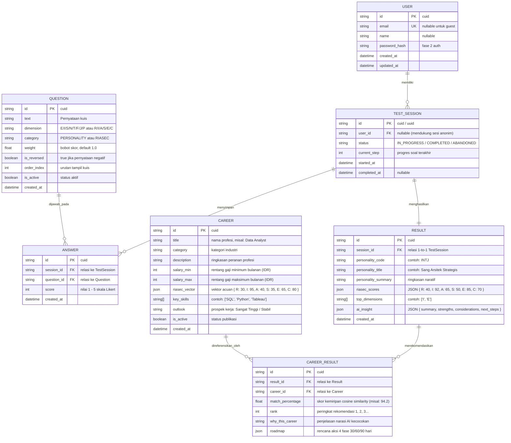

# Database Schema & Entity Relationship Diagram (ERD)
**Project:** AKARA — AI Career Platform  
**Database Engine:** PostgreSQL (Neon Serverless)  
**ORM:** Prisma ORM  
**Target File:** `server/prisma/schema.prisma`

---

## 1. Visual Entity Relationship Diagram (ERD)



---

## 2. Kode Siap Pakai: `server/prisma/schema.prisma`

Salin kode di bawah ini langsung ke dalam file `server/prisma/schema.prisma`:

```prisma
// server/prisma/schema.prisma

generator client {
  provider = "prisma-client-js"
}

datasource db {
  provider  = "postgresql"
  url       = env("DATABASE_URL")
  directUrl = env("DIRECT_URL")
}

// ==========================================
// 1. USER & AUTH (Fase 2, Opsional di MVP)
// ==========================================
model User {
  id           String        @id @default(cuid())
  email        String?       @unique
  name         String?
  passwordHash String?       @map("password_hash")
  createdAt    DateTime      @default(now()) @map("created_at")
  updatedAt    DateTime      @updatedAt @map("updated_at")

  sessions     TestSession[]

  @@map("users")
}

// ==========================================
// 2. QUESTION BANK (Bank Soal Asesmen)
// ==========================================
enum QuestionCategory {
  PERSONALITY
  RIASEC
}

model Question {
  id         String           @id @default(cuid())
  text       String
  dimension  String           // MBTI: E/I/S/N/T/F/J/P | RIASEC: R/I/A/S/E/C
  category   QuestionCategory
  weight     Float            @default(1.0)
  isReversed Boolean          @default(false) @map("is_reversed")
  orderIndex Int              @default(0) @map("order_index")
  isActive   Boolean          @default(true) @map("is_active")
  createdAt  DateTime         @default(now()) @map("created_at")

  answers    Answer[]

  @@index([category, dimension])
  @@map("questions")
}

// ==========================================
// 3. TEST SESSION (Sesi Pengerjaan Kuis)
// ==========================================
enum SessionStatus {
  IN_PROGRESS
  COMPLETED
  ABANDONED
}

model TestSession {
  id          String        @id @default(cuid())
  userId      String?       @map("user_id")
  status      SessionStatus @default(IN_PROGRESS)
  currentStep Int           @default(1) @map("current_step")
  startedAt   DateTime      @default(now()) @map("started_at")
  completedAt DateTime?     @map("completed_at")

  user        User?         @relation(fields: [userId], references: [id], onDelete: SetNull)
  answers     Answer[]
  result      Result?

  @@index([userId])
  @@map("test_sessions")
}

// ==========================================
// 4. ANSWER (Jawaban Skala Likert User)
// ==========================================
model Answer {
  id         String      @id @default(cuid())
  sessionId  String      @map("session_id")
  questionId String      @map("question_id")
  score      Int         // Nilai 1 s/d 5
  createdAt  DateTime    @default(now()) @map("created_at")

  session    TestSession @relation(fields: [sessionId], references: [id], onDelete: Cascade)
  question   Question    @relation(fields: [questionId], references: [id], onDelete: Cascade)

  @@unique([sessionId, questionId])
  @@index([sessionId])
  @@map("answers")
}

// ==========================================
// 5. RESULT (Hasil Kalkulasi Skor & AI)
// ==========================================
model Result {
  id                 String         @id @default(cuid())
  sessionId          String         @unique @map("session_id")
  personalityCode    String         @map("personality_code")    // Contoh: INTJ
  personalityTitle   String         @map("personality_title")   // Contoh: Sang Arsitek Strategis
  personalitySummary String         @map("personality_summary") @db.Text
  riasecScores       Json           @map("riasec_scores")       // { R: 40, I: 92, A: 65, S: 50, E: 85, C: 70 }
  topDimensions      String[]       @map("top_dimensions")      // ["I", "E"]
  aiInsight          Json?          @map("ai_insight")          // { summary, strengths, considerations, next_steps }
  createdAt          DateTime       @default(now()) @map("created_at")

  session            TestSession    @relation(fields: [sessionId], references: [id], onDelete: Cascade)
  careerMatches      CareerResult[]

  @@map("results")
}

// ==========================================
// 6. CAREER (Katalog Profil Karier)
// ==========================================
model Career {
  id           String         @id @default(cuid())
  title        String         @unique
  category     String         // Contoh: Teknologi & Analitika
  description  String         @db.Text
  salaryMin    Int            @map("salary_min") // Contoh: 8000000 (Rp 8 Juta)
  salaryMax    Int            @map("salary_max") // Contoh: 16000000 (Rp 16 Juta)
  riasecVector Json           @map("riasec_vector") // { R: 30, I: 95, A: 40, S: 35, E: 65, C: 80 }
  keySkills    String[]       @map("key_skills")    // ["SQL", "Python", "Data Viz"]
  outlook      String?        // Contoh: "Sangat Tinggi"
  isActive     Boolean        @default(true) @map("is_active")
  createdAt    DateTime       @default(now()) @map("created_at")

  careerMatches CareerResult[]

  @@index([category])
  @@map("careers")
}

// ==========================================
// 7. CAREER RESULT (Pivot Hasil Rekomendasi)
// ==========================================
model CareerResult {
  id              String   @id @default(cuid())
  resultId        String   @map("result_id")
  careerId        String   @map("career_id")
  matchPercentage Float    @map("match_percentage") // Contoh: 94.5
  rank            Int                               // 1, 2, 3 ...
  whyThisCareer   String?  @map("why_this_career") @db.Text
  roadmap         Json?                             // 4-Phase Roadmap JSON

  result          Result   @relation(fields: [resultId], references: [id], onDelete: Cascade)
  career          Career   @relation(fields: [careerId], references: [id], onDelete: Cascade)

  @@unique([resultId, careerId])
  @@index([resultId, rank])
  @@map("career_results")
}
```

---

## 3. Catatan Implementasi & Perintah CLI

Setelah Rozi membuat file di atas pada `server/prisma/schema.prisma`:

1. **Jalankan Migrasi Database Pertama Kali**:
   ```bash
   npx prisma migrate dev --name init_akara_core
   ```
2. **Lihat Tampilan Database via Prisma Studio (GUI Visual)**:
   ```bash
   npx prisma studio
   ```
   *Prisma Studio akan terbuka di browser pada `http://localhost:5555` untuk melihat dan mengedit data tabel secara visual.*
