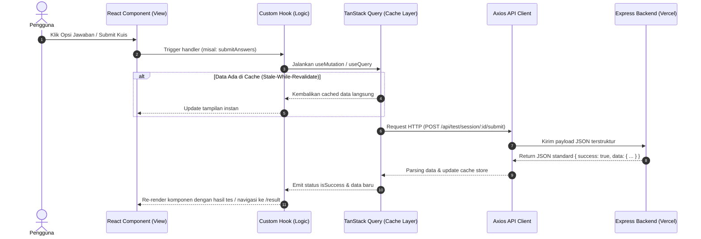

# Frontend Architecture, Code Convention & Data Flow
**Project:** AKARA — AI Career Platform  
**Target Directory:** `client/` (dalam root workspace `AKARA/`)  
**Stack:** React 19/18 + Vite + TypeScript + Tailwind CSS + shadcn/ui + TanStack Query + Recharts

---

## 1. Struktur Folder (Feature-Based Architecture)

Struktur proyek menggunakan pendekatan **Feature-Based (Vertical Slicing)**. Kode dikelompokkan berdasarkan domain fitur bisnis, bukan jenis file teknis. Ini memastikan skalabilitas, kemudahan navigasi, dan isolasi kode antar pengembang (Rozi & Diki).

```text
client/
├── public/                     # Aset statis publik (favicon, static illustrations)
├── src/
│   ├── assets/                 # Image, icons, font internal yang di-bundle Vite
│   ├── components/             # Komponen global / reusable non-domain
│   │   ├── common/             # Button khusus, Card wrapper, EmptyState, Badge
│   │   ├── layout/             # Navbar, Footer, Sidebar, Container, MainLayout
│   │   └── ui/                 # Komponen shadcn/ui (Button, Dialog, Toast, Input, dll.)
│   ├── config/                 # Konfigurasi aplikasi & environment variables
│   │   └── env.ts              # Validasi env via Zod (VITE_API_BASE_URL, dll.)
│   ├── features/               # DOMAIN FITUR UTAMA
│   │   ├── assessment/         # Fitur kuis Likert, progress, state jawaban
│   │   │   ├── api/            # API call (getQuestions, submitAnswers)
│   │   │   ├── components/     # QuestionCard, ProgressBar, ScaleSelector
│   │   │   ├── hooks/          # useAssessmentSession, useSubmitQuiz
│   │   │   ├── types/          # Tipe data spesifik kuis & jawaban
│   │   │   └── utils/          # Normalisasi jawaban, helper indexing
│   │   ├── result/             # Fitur hasil tes, insight AI, radar chart
│   │   │   ├── api/            # getTestResult, getAIInsight
│   │   │   ├── components/     # PersonalityCard, RiasecRadarChart, AIInsightBox
│   │   │   ├── hooks/          # useTestResult, useAIInsight
│   │   │   └── types/          # Result types, RIASEC scores
│   │   ├── career/             # Fitur katalog karier & perbandingan
│   │   │   ├── api/            # getCareers, getCareerDetail, compareCareers
│   │   │   ├── components/     # CareerCard, CareerFilter, ComparisonModal
│   │   │   ├── hooks/          # useCareers, useCareerDetail
│   │   │   └── types/          # Career types, skill match requirements
│   │   └── roadmap/            # Fitur AI Career Roadmap & Action Plan
│   │       ├── api/            # generateCareerRoadmap
│   │       ├── components/     # RoadmapTimeline, MilestoneCard, Checklist30_60_90
│   │       ├── hooks/          # useCareerRoadmap
│   │       └── types/          # Action plan & roadmap step types
│   ├── hooks/                  # Global custom hooks (useTheme, useMediaQuery, useDebounce)
│   ├── lib/                    # Inisialisasi library pihak ketiga
│   │   ├── api-client.ts       # Axios instance dengan interceptors & base URL
│   │   ├── query-client.ts     # TanStack Query Client konfigurasi
│   │   └── utils.ts            # Utility global (fungsi cn() clsx + twMerge)
│   ├── routes/                 # Routing aplikasi (React Router v6/v7)
│   │   ├── index.tsx           # Router provider & route definitions
│   │   └── ProtectedRoute.tsx  # Guard untuk halaman yang butuh sesi/hasil
│   ├── types/                  # Global shared TypeScript definitions & API response models
│   │   └── api.ts              # ApiResponse<T>, ApiError
│   ├── App.tsx                 # Root component (Providers wrapper)
│   ├── main.tsx                # Vite entry point
│   └── index.css               # Tailwind CSS directives & theme variables
├── .env.example                # Template variabel lingkungan
├── package.json
├── tailwind.config.js
├── tsconfig.json
└── vite.config.ts
```

---

## 2. Standar & Konvensi Kode (Code Conventions)

### 2.1 Penamaan (Naming Conventions)

| Tipe Entitas | Konvensi | Contoh |
| :--- | :--- | :--- |
| **Komponen React** | PascalCase | `QuestionCard.tsx`, `RiasecRadarChart.tsx` |
| **Custom Hooks** | camelCase diawali `use` | `useAssessmentSession.ts`, `useSubmitQuiz.ts` |
| **Utility Functions** | camelCase | `calculateProgress.ts`, `formatScore.ts` |
| **TypeScript Types & Interfaces** | PascalCase | `AssessmentQuestion`, `CareerDetail` |
| **Konstanta & Enums** | UPPER_SNAKE_CASE | `MAX_QUESTIONS_PER_PAGE`, `API_TIMEOUT_MS` |
| **Folder Komponen / Fitur** | kebab-case | `features/assessment/`, `components/layout/` |

### 2.2 Aturan TypeScript
- **Sebisa mungkin hindari `any`**. Jika tipe data dinamis/belum pasti, gunakan `unknown` dengan *type guard* atau *Zod schema*.
- Gunakan `type` untuk union, primitives, atau utility types; gunakan `interface` untuk struktur data model objek yang dapat di-extend.
- Semua response API dari backend wajib dibuatkan kontrak tipenya di `src/types/api.ts` atau `features/<feature>/types/`.

Contoh standard wrapper response:
```typescript
// src/types/api.ts
export interface ApiResponse<T> {
  success: boolean;
  data: T;
  message?: string;
}

export interface ApiErrorResponse {
  success: false;
  message: string;
  errors?: Record<string, string[]>;
}
```

### 2.3 Komponen React & Pemisahan Logika (Separation of Concerns)
- **Komponen Presentasional Murni**: Komponen JSX harus fokus merender UI. Hindari meletakkan `useEffect` kompleks atau kalkulasi data berat langsung di dalam JSX.
- **Ekstraksi ke Custom Hook**: Semua logika fetching, state kuis, dan handler diletakkan di file `hooks/` terkait.

Contoh yang benar:
```tsx
// features/assessment/components/QuestionCard.tsx
interface QuestionCardProps {
  question: AssessmentQuestion;
  selectedScore: number | null;
  onSelectScore: (score: number) => void;
}

export const QuestionCard: React.FC<QuestionCardProps> = ({
  question,
  selectedScore,
  onSelectScore,
}) => {
  return (
    <div className="p-6 rounded-2xl bg-card border shadow-sm">
      <h3 className="text-lg font-semibold">{question.text}</h3>
      <ScaleSelector value={selectedScore} onChange={onSelectScore} />
    </div>
  );
};
```

### 2.4 State Management Rules
1. **Server State (Data API)**: Gunakan **TanStack Query (React Query)** untuk fetching, caching, loading state, dan invalidasi otomatis.
2. **Local UI State**: Gunakan `useState` atau `useReducer` untuk state lokal seperti modal open/close, accordion, dropdown.
3. **URL State**: Gunakan URL query parameters (`searchParams`) untuk filter karier, pagination, atau tab aktif agar halaman bisa di-bookmark dan di-*share*.

---

## 3. Alur Data (Data Flow Architecture)



---

## 4. Konfigurasi API Client & Interceptors

Inisialisasi API client terpusat di `src/lib/api-client.ts`:

```typescript
import axios from 'axios';

export const apiClient = axios.create({
  baseURL: import.meta.env.VITE_API_BASE_URL || '/api',
  timeout: 15000,
  headers: {
    'Content-Type': 'application/json',
  },
});

// Response interceptor untuk standardisasi error handling
apiClient.interceptors.response.use(
  (response) => response.data,
  (error) => {
    const message = error.response?.data?.message || 'Terjadi kesalahan pada sistem.';
    return Promise.reject(new Error(message));
  }
);
```

---

## 5. Panduan Testing Frontend (Vitest + React Testing Library)

Pengujian frontend berfokus pada keandalan interaksi user, custom hooks, dan render visual komponen.

### 5.1 Tooling & Setup
- **Test Runner**: [Vitest](https://vitest.dev/) (native Vite integration, instan & super cepat).
- **DOM Environment**: `jsdom`.
- **Testing Utilities**: `@testing-library/react`, `@testing-library/user-event`, `@testing-library/jest-dom`.

### 5.2 Lokasi & Penamaan File Test
File test diletakkan berdampingan (*colocated*) dengan file yang diuji:
```text
features/assessment/
├── components/
│   ├── ScaleSelector.tsx
│   └── ScaleSelector.test.tsx      # Unit test komponen
├── hooks/
│   ├── useAssessmentSession.ts
│   └── useAssessmentSession.test.ts # Unit test custom hook
```

### 5.3 Contoh Unit Test Komponen (`ScaleSelector.test.tsx`)
```typescript
import { render, screen, fireEvent } from '@testing-library/react';
import { describe, it, expect, vi } from 'vitest';
import { ScaleSelector } from './ScaleSelector';

describe('ScaleSelector Component', () => {
  it('harus merender 5 pilihan skala Likert dengan benar', () => {
    const onChangeMock = vi.fn();
    render(<ScaleSelector value={3} onChange={onChangeMock} />);

    const buttons = screen.getAllByRole('button');
    expect(buttons).toHaveLength(5);
  });

  it('harus memicu callback onChange saat skala diklik', () => {
    const onChangeMock = vi.fn();
    render(<ScaleSelector value={null} onChange={onChangeMock} />);

    const scale5 = screen.getByLabelText(/sangat setuju/i);
    fireEvent.click(scale5);

    expect(onChangeMock).toHaveBeenCalledWith(5);
  });
});
```

### 5.4 Perintah Script Testing
```bash
# Menjalankan test secara interaktif (watch mode) saat ngoding
npm run test

# Menjalankan test sekali jalan (CI / Pre-PR check)
npm run test:run

# Melihat coverage laporan pengujian
npm run test:coverage
```

> [!IMPORTANT]
> **Aturan Wajib Sebelum PR**:  
> Developer wajib menjalankan `npm run test:run` dan memastikan **ALL TESTS PASS (100%)** di komputer lokal sebelum membuka Pull Request ke branch `develop`.
