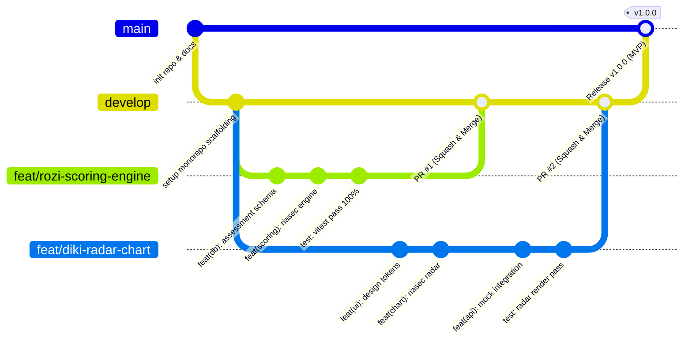
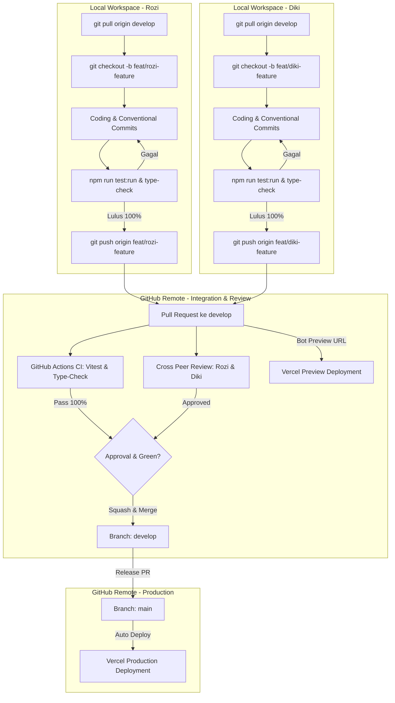

# Git Workflow & Collaboration Guidelines
**Project:** AKARA AI Career Platform  
**Developers:** Rozi (@rozi) & Diki (@diki)  
**Version Control:** Git & GitHub

---

## 1. Branching Strategy

### 1.1 Diagram Siklus Percabangan (Git Graph)



### 1.2 Diagram Alur Sistem (End-to-End Pipeline)



### Definisi Branch:

| Branch | Fungsi | Akses & Aturan |
| :--- | :--- | :--- |
| `main` | Production code. Terkoneksi otomatis dengan Vercel Production deployment. | **Protected**. Tidak boleh push langsung. Hanya via PR dari `develop`. |
| `develop` | Branch integrasi utama. Tempat menggabungkan seluruh fitur yang sudah selesai diuji. | **Protected**. Push langsung dibatasi. Merge via PR yang sudah di-review. |
| `feat/<nama-fitur>` | Branch kerja pengerjaan fitur baru. | Dibuat dari `develop`, dimerge kembali ke `develop`. |
| `fix/<nama-bug>` | Branch perbaikan bug yang ditemukan saat integrasi atau testing. | Dibuat dari `develop`, dimerge ke `develop`. |
| `hotfix/<nama-bug>` | Perbaikan darurat bug kritis di production. | Dibuat dari `main`, dimerge ke `main` dan `develop`. |

---

## 2. Format Penamaan Branch

Format: `<tipe>/<nama-developer>-<nama-fitur-singkat>` (kebab-case)

Contoh:
- `feat/rozi-assessment-engine`
- `feat/diki-career-radar-chart`
- `feat/rozi-ai-insight-gemini`
- `fix/diki-chart-tooltip-overlap`

---

## 3. Standar Pesan Commit (Conventional Commits)

Format commit pesan:
```text
<tipe>(<scope opsional>): <deskripsi singkat imperative lowercase>
```

### Tipe Commit:
- **`feat`**: Penambahan fitur baru (frontend atau backend).
- **`fix`**: Perbaikan bug atau error logic.
- **`docs`**: Perubahan dokumentasi (PRD, README, komentar code).
- **`refactor`**: Perubahan struktur kode tanpa mengubah fungsionalitas fitur.
- **`test`**: Penambahan atau perbaikan unit test / integration test.
- **`chore`**: Update dependency, konfigurasi build (Vite/TSConfig), tooling.
- **`style`**: Format kode (spasi, semicolon, perapian Tailwind classes).

### Contoh Pesan Commit yang Benar:
```bash
feat(scoring): implement cosine similarity calculation for riasec
feat(frontend): add interactive scale selector for assessment questions
fix(ai): handle gemini timeout fallback gracefully
docs(api): add swagger openapi annotations for career endpoints
chore: setup prisma client with neon connection pooling
```

---

## 4. Siklus Kerja Harian (Daily Step-by-Step Workflow)

### Langkah 1: Tarik Perubahan Terbaru
Sebelum mulai ngoding fitur baru, pastikan branch lokal sinkron:
```bash
git checkout develop
git pull origin develop
```

### Langkah 2: Buat Branch Fitur Baru
```bash
git checkout -b feat/rozi-scoring-engine
```

### Langkah 3: Kerjakan Fitur & Commit Bertahap
Ikuti urutan pengerjaan fitur sesuai standar 6 langkah di `TEAM_TASK_DIVISION.md` (Database -> Service -> Controller -> API Client -> Hooks -> UI Slicing). Commit sesering mungkin dengan pesan yang jelas dan modular:
```bash
git add .
git commit -m "feat(scoring): add reverse scoring logic for negative statements"
```

### Langkah 4: Jalankan Testing Lokal & Type Check (Wajib Lulus!)
Sebelum melakukan push, pastikan kode lulus uji dan tidak merusak fitur lain:
```bash
# Frontend & Backend: Jalankan test sekali jalan
npm run test:run

# Pastikan tidak ada error TypeScript
npm run type-check
```
> [!CAUTION]
> **Dilarang push/PR jika ada test yang gagal!** Perbaiki kode atau perbarui test terlebih dahulu sampai semua status berwarna hijau.

### Langkah 5: Push ke Remote Repository
```bash
git push -u origin feat/rozi-scoring-engine
```

---

## 5. Panduan Pull Request (PR) & Code Review

1. **Buka PR ke branch `develop`** (bukan ke `main`).
2. **Quality Gate Wajib (All Tests Pass)**:
   - CI check GitHub Actions akan otomatis menjalankan test suite Vitest.
   - **PR dilarang dimerge jika ada test yang gagal (merah)** atau build error.
3. **Isi Template PR:**
   - **Apa yang diubah?** (Ringkasan perubahan).
   - **Hasil Testing:** Sertakan konfirmasi bahwa `npm run test:run` sudah lulus 100%.
   - **Bagaimana cara mengujinya?** (Langkah verifikasi manual / endpoint yang dites).
   - **Tangkapan Layar (jika UI):** Lampirkan screenshot tampilan hasil kerja.
4. **Review Wajib:**
   - Jika Rozi membuat PR, **Diki wajib mereview** dan memberikan approval (atau sebaliknya).
   - Pastikan tidak ada `console.log` liar, `any` pada TypeScript, atau logic yang melanggar konvensi arsitektur.
5. **Strategi Merge:**
   - Gunakan opsi **Squash and Merge** di GitHub agar commit history di branch `develop` tetap bersih, rapi, dan mudah di-track.
6. **Hapus Branch Fitur**: Hapus branch fitur di remote setelah berhasil dimerge ke `develop`.

---

## 6. Integrasi Vercel Preview Deployments

- Setiap kali PR dibuka dari branch `feat/...` ke `develop`, bot Vercel akan otomatis membangun *Preview Deployment* gratis.
- Rozi & Diki dapat langsung menguji aplikasi secara live melalui tautan URL Preview yang diberikan bot Vercel pada komentar PR sebelum menekan tombol *Merge*.

---

## 7. Panduan Operasional: Penanganan Sinkronisasi & Git Conflict

Berikut panduan teknis ketika terjadi ketidaksinkronan branch lokal dengan remote atau saat muncul merge conflict.

### Skenario A: Sinkronisasi Saat Terdapat Perubahan Lokal Belum Di-commit
Kondisi ketika terdapat perubahan kode lokal yang belum di-commit, sementara remote branch sudah memiliki commit baru:
```bash
# 1. Simpan sementara perubahan lokal ke stash
git stash

# 2. Tarik pembaruan terbaru dari remote
git pull origin develop

# 3. Terapkan kembali perubahan lokal dari stash
git stash pop
```
*Jika tidak terdapat benturan baris kode yang sama, perubahan lokal akan otomatis tergabung.*

---

### Skenario B: Push Ditolak Karena Remote Lebih Maju (Non-Fast-Forward)
Kondisi ketika push ditolak oleh GitHub:  
`! [rejected] develop -> develop (fetch first) error: failed to push some refs`

Langkah penyelesaian menggunakan rebase agar riwayat commit tetap linear:
```bash
# Tarik perubahan remote dan posisikan commit lokal di paling atas
git pull --rebase origin develop
```
- Jika tidak ada conflict: proses rebase selesai otomatis, lanjutkan dengan `git push`.
- Jika terdapat conflict: Git akan menghentikan proses sementara untuk penyelesaian konflik.

---

### Skenario C: Identifikasi & Penyelesaian Merge/Rebase Conflict

Ketika Git mendeteksi modifikasi pada baris yang sama di file yang sama, Git menambahkan penanda konflik (*conflict markers*):

```text
<<<<<<< HEAD (Versi lokal)
const matchScore = Math.round(similarity * 100);
=======
const matchScore = calculateMatchPercentage(similarity);
>>>>>>> origin/develop (Versi remote)
```

#### Langkah Penyelesaian:
1. **Buka file terkait di editor (VS Code / IDE).**
2. Gunakan opsi penanganan yang tersedia pada editor:
   - **Accept Current Change**: Mempertahankan versi lokal.
   - **Accept Incoming Change**: Menggunakan versi remote.
   - **Accept Both Changes**: Menggabungkan kedua implementasi.
   - **Edit Manual**: Menghapus penanda `<<<<<<<`, `=======`, `>>>>>>>`, lalu menyusun kode sesuai kebutuhan fungsional.
3. Simpan file yang telah disesuaikan.
4. Tandai file sebagai terselesaikan:
   ```bash
   git add <nama-file-yang-conflict>
   ```
5. Lanjutkan proses Git:
   - Jika proses **Rebase**:
     ```bash
     git rebase --continue
     ```
   - Jika proses **Merge**:
     ```bash
     git commit -m "fix(conflict): resolve merge conflict on <nama-file>"
     ```
6. Jalankan pengujian untuk memvalidasi fungsi:
   ```bash
   npm run test:run
   ```
7. Lakukan push ke remote repository:
   ```bash
   git push origin <nama-branch>
   ```

---

### Skenario D: Pemisahan Branch Ketika Terlanjur Bekerja di Branch `develop`

Kondisi ketika penulisan kode dilakukan di branch `develop` lokal sebelum membuat branch `feat/...`:

#### Kasus 1: Perubahan Belum Di-commit
```bash
# Buat dan beralih ke branch fitur baru (perubahan kerja otomatis terbawa)
git checkout -b feat/<nama-fitur>
```

#### Kasus 2: Perubahan Sudah Terlanjur Di-commit di Lokal
```bash
# 1. Simpan commit ke branch fitur baru
git branch feat/<nama-fitur>

# 2. Reset branch develop lokal agar sinkron dengan origin/develop
git reset --hard origin/develop

# 3. Pindah ke branch fitur untuk melanjutkan pekerjaan
git checkout feat/<nama-fitur>
```

---

### Pembatalan Operasi (Emergency Abort)
Jika diperlukan pembatalan proses dan pengembalian repository ke status sebelum pull/merge:

- Pembatalan Rebase:
  ```bash
  git rebase --abort
  ```
- Pembatalan Merge:
  ```bash
  git merge --abort
  ```

---

### 8. Praktik Baik Pencegahan Conflict
1. **Sinkronisasi Berkala**: Jalankan `git pull origin develop` sebelum memulai sesi pengerjaan fitur baru.
2. **Koordinasi Berbagi File**: Konfirmasikan perubahan pada file sentral seperti `package.json`, `App.tsx`, atau konfigurasi routing.
3. **Ukuran PR Terukur**: Buat commit dan PR berukuran modular untuk meminimalkan benturan kode.
4. **Isolasi Fitur**: Satu branch fitur berfokus pada satu fungsionalitas spesifik.
