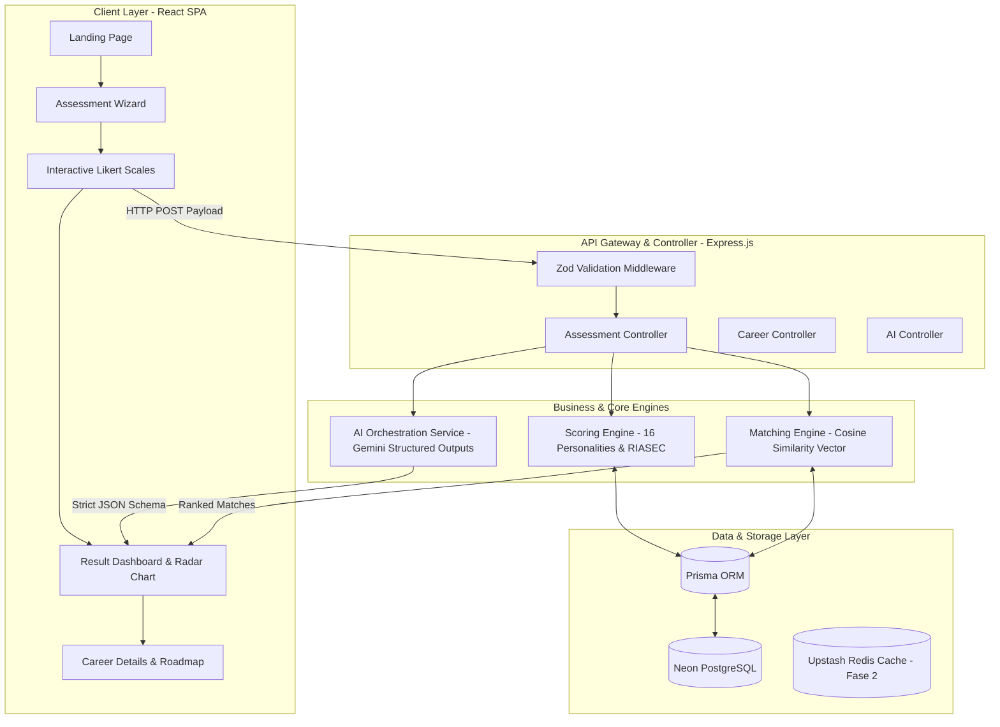

# AKARA AI-Powered Career Platform

AI-driven career exploration and structured planning platform designed for Indonesian students and fresh graduates. Combines scientific Holland RIASEC psychometrics, deterministic Cosine Similarity vector matching, and Google Gemini AI orchestration to deliver actionable, transparent career guidance.

---

## Ringkasan Eksekutif

Banyak tes kepribadian populer hanya berhenti pada label psikologis umum tanpa memberikan arahan karier yang terukur dan aplikatif. Sebaliknya, platform bimbingan karier konvensional seringkali terasa kaku dan mengintimidasi bagi pencari kerja pemula.

**AKARA** hadir menjembatani kesenjangan tersebut melalui pendekatan hibrida:
1. **Engine Deterministik**: Penilaian psikometrik dan persentase kecocokan profesi dihitung 100% menggunakan matematika deterministik (vektor Cosine Similarity), memastikan objektivitas dan kebebasan dari bias halusinasi LLM.
2. **AI Action Roadmap**: Model bahasa (Google Gemini 2.5 Flash) berperan khusus menerjemahkan metrik skor menjadi narasi wawasan kepribadian serta peta jalan aksi 4 fase (30/60/90 hari).
3. **Gamified Visual Experience**: Desain antarmuka mengadopsi estetika bertema buku cerita (Duolingo-inspired) dengan kanvas putih bersih, tombol taktil berbobot stiker, dan visualisasi grafik radar poligon interaktif.

---

## Arsitektur Sistem & Alur Data



---

## Keunggulan & Diferensiasi Teknis

### 1. Dual-Layer Scoring & Matching
- **Layer 1 (Deterministik)**: Normalisasi 6 dimensi Holland RIASEC (Realistic, Investigative, Artistic, Social, Enterprising, Conventional) dan perbandingan vektor data karier acuan menggunakan rumus Cosine Similarity:
  $$\text{Similarity}(A, B) = \frac{A \cdot B}{\|A\| \|B\|}$$
- **Layer 2 (Generatif)**: AI tidak diizinkan mengubah angka skor. AI hanya menerima data terstruktur via Zod Schema untuk memproduksi narasi kelebihan (*strengths*), pertimbangan (*considerations*), dan langkah persiapan karier.

### 2. Guardrail & Keamanan Data
- API Key AI dan kredensial database terisolasi sepenuhnya di sisi server.
- Sanitasi input ketat dengan skema Zod pada setiap layer controller.
- Proteksi error operasional dengan custom error handler `AppError`.

### 3. Visual Identity & Design System
- Mengadopsi prinsip desain dari `DESIGN.md`:
  - Canvas: Paper White (`#ffffff`).
  - Primary Accent: Eager Green (`#58cc02`).
  - Secondary Accent: Spark Blue (`#1cb0f6`).
  - Tactile Elements: Radius sudut `12px` (`rounded-xl`) dengan border tegas `2px solid #afafaf`.
  - Typography: Display heading membulat (*Nunito Black* / *Feather*) dan body text sans-serif (*Inter*).

---

## Struktur Monorepo

Repositori ini menggunakan arsitektur monorepo terpadu:

```text
AKARA/
├── client/                     # Frontend Application (React + Vite SPA)
│   ├── public/                 # Static public assets
│   ├── src/
│   │   ├── components/         # Reusable design system & layout components
│   │   ├── features/           # Domain-driven features (assessment, result, career)
│   │   ├── hooks/              # Global custom hooks
│   │   ├── lib/                # API client (Axios) & Query client (TanStack)
│   │   ├── routes/             # Client-side routing (React Router v6/v7)
│   │   └── types/              # TypeScript definitions & API models
│   ├── package.json
│   ├── tailwind.config.js
│   └── vite.config.ts
│
├── server/                     # Backend API Service (Express + TypeScript)
│   ├── api/                    # Vercel serverless entry point
│   ├── prisma/                 # Database schema & seeding scripts
│   │   ├── schema.prisma       # Prisma data models
│   │   └── seed.ts             # Initial question bank & career datasets
│   ├── src/
│   │   ├── controllers/        # HTTP request & response handlers
│   │   ├── middlewares/        # Zod validation & global error handlers
│   │   ├── routes/             # Express API route endpoints
│   │   ├── services/           # Pure business logic (scoring, matching, AI)
│   │   ├── utils/              # Custom AppError & response wrappers
│   │   └── app.ts              # Express application setup
│   ├── package.json
│   └── tsconfig.json
│
├── .gitignore
└── README.md
```

---

## Matriks Teknologi (Tech Stack)

| Domain | Teknologi | Fungsi & Alasan Pemilihan |
| :--- | :--- | :--- |
| **Client Framework** | React 19/18 + Vite | Single Page Application (SPA) cepat, modular, dan zero cold-start |
| **Client Routing** | React Router v6/v7 | Deklaratif, stabil, dan ramah untuk pemeliharaan tim |
| **Client State / Cache** | TanStack Query v5 | Sinkronisasi server state, caching instan, dan status loading rapi |
| **Client Styling** | Tailwind CSS + shadcn/ui | Kustomisasi token desain Duolingo secara presisi |
| **Data Visualization**| Recharts | Render poligon RIASEC Radar Chart interaktif dan responsif |
| **Server Framework** | Node.js + Express | Runtime cepat, penanganan asynchronous I/O efisien |
| **Language** | TypeScript | Type safety end-to-end mencegah runtime error |
| **Database & ORM** | PostgreSQL (Neon) + Prisma | Relational database serverless stabil dengan tipe skema otomatis |
| **AI Engine** | Google Gemini 2.5 Flash | Structured Output JSON native dengan latensi rendah dan kuota gratis luas |
| **Testing Suite** | Vitest + Supertest + RTL | Unified test runner super cepat untuk backend dan frontend |
| **Code Quality** | ESLint + Prettier | Standardisasi format kode dan penataan otomatis class Tailwind |

---

## Panduan Instalasi & Menjalankan Lokal

### Prasyarat
- Node.js versi 18 atau lebih baru
- npm, pnpm, atau yarn
- Akun PostgreSQL gratis di [Neon.tech](https://neon.tech/)
- API Key Google Gemini gratis di [Google AI Studio](https://aistudio.google.com/)

### Langkah 1: Kloning Repositori
```bash
git clone https://github.com/<username>/akara.git
cd akara
```

### Langkah 2: Setup Server (Backend)
```bash
cd server
npm install

# Buat file konfigurasi lingkungan
cp .env.example .env

# Jalankan migrasi dan seeding database
npx prisma migrate dev --name init_akara
npx prisma db seed

# Jalankan server dalam mode development
npm run dev
```
Server backend akan aktif di `http://localhost:5000` dan dokumentasi Swagger interaktif di `http://localhost:5000/api-docs`.

### Langkah 3: Setup Client (Frontend)
Buka tab terminal baru:
```bash
cd client
npm install

# Jalankan server frontend Vite
npm run dev
```
Aplikasi web akan aktif di `http://localhost:5173`.

---

## Standar Pengujian (Testing Quality Gate)

AKARA menerapkan kebijakan kualitas ketat sebelum kode dapat digabungkan ke branch `develop`:

```bash
# Menjalankan pengujian server
cd server
npm run test:run

# Menjalankan pengujian client
cd client
npm run test:run
```

Setiap Pull Request wajib memiliki status kelulusan pengujian 100% tanpa kegagalan (*Zero Failing Tests*).

---

## Indeks Dokumentasi Teknis

Dokumentasi terperinci tersedia pada file-file berikut:

| Nama Dokumen | Topik & Cakupan |
| :--- | :--- |
| **[AKARA_PRD_v2_AI_Career_Platform.md](./AKARA_PRD_v2_AI_Career_Platform.md)** | Spesifikasi kebutuhan produk, alur pengguna, guardrails, & fitur lengkap |
| **[TEAM_TASK_DIVISION.md](./TEAM_TASK_DIVISION.md)** | Pembagian tugas Rozi vs Diki, alur kerja 6 langkah, & roadmap Sprint 1 |
| **[DATABASE_SCHEMA.md](./DATABASE_SCHEMA.md)** | Diagram ERD visual & model Prisma schema siap pakai |
| **[API_CONTRACTS.md](./API_CONTRACTS.md)** | Spesifikasi request-response JSON baku beserta mock data frontend |
| **[ENV_SETUP.md](./ENV_SETUP.md)** | Panduan konfigurasi `.env` dan setup akun cloud gratis |
| **[DESIGN.md](./DESIGN.md)** | Desain sistem dan token visual terinspirasi dari Duolingo |
| **[GOOGLE-STICH.md](./GOOGLE-STICH.md)** | Koleksi prompt untuk pembuatan prototipe antarmuka di Google Stitch |
| **[FRONTEND_CONVENTION.md](./FRONTEND_CONVENTION.md)** | Konvensi kode client, struktur fitur, custom hooks, dan testing |
| **[BACKEND_CONVENTION.md](./BACKEND_CONVENTION.md)** | Konvensi kode server, error handling AppError, dan standar API |
| **[GIT_WORKFLOW.md](./GIT_WORKFLOW.md)** | Strategi percabangan Git, format commit, dan panduan resolusi konflik |

---

## Tim Pengembang

- **Rozi** ([@rozi](https://github.com/RahmadFahrurrozi))
- **Diki** ([@diki](https://github.com/dikydharmawwan))

---

